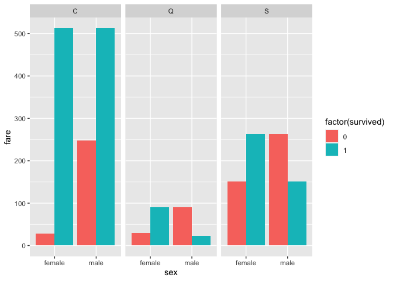
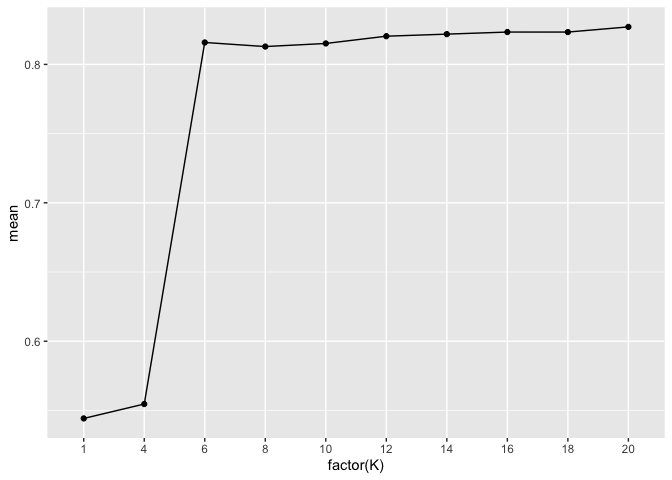
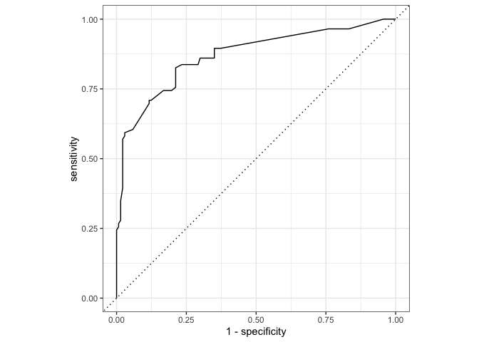

Titanic prediction by KNN and XGBoost
================
Chung-Hao Lee
7/24/2021

<!-- README.md is generated from Titanic_competition.Rmd. Please edit that file --> 

``` r
library("tidyverse")
```

    ## ── Attaching packages ─────────────────────────────────────── tidyverse 1.3.1 ──

    ## ✓ ggplot2 3.3.5     ✓ purrr   0.3.4
    ## ✓ tibble  3.1.2     ✓ dplyr   1.0.7
    ## ✓ tidyr   1.1.3     ✓ stringr 1.4.0
    ## ✓ readr   1.4.0     ✓ forcats 0.5.1

    ## ── Conflicts ────────────────────────────────────────── tidyverse_conflicts() ──
    ## x dplyr::filter() masks stats::filter()
    ## x dplyr::lag()    masks stats::lag()

``` r
library("tidymodels")
```

    ## ── Attaching packages ────────────────────────────────────── tidymodels 0.1.2 ──

    ## ✓ broom     0.7.8      ✓ recipes   0.1.15
    ## ✓ dials     0.0.9      ✓ rsample   0.1.1 
    ## ✓ infer     0.5.4      ✓ tune      0.1.6 
    ## ✓ modeldata 0.1.0      ✓ workflows 0.2.4 
    ## ✓ parsnip   0.1.5      ✓ yardstick 0.0.8

    ## ── Conflicts ───────────────────────────────────────── tidymodels_conflicts() ──
    ## x scales::discard() masks purrr::discard()
    ## x dplyr::filter()   masks stats::filter()
    ## x recipes::fixed()  masks stringr::fixed()
    ## x dplyr::lag()      masks stats::lag()
    ## x yardstick::spec() masks readr::spec()
    ## x recipes::step()   masks stats::step()

``` r
library("mice")
```

    ## 
    ## Attaching package: 'mice'

    ## The following object is masked from 'package:stats':
    ## 
    ##     filter

    ## The following objects are masked from 'package:base':
    ## 
    ##     cbind, rbind

``` r
knitr::opts_chunk$set(
  collapse = TRUE, 
  comment = "#>",
  fig.path = "fig/figures/README-",
  out.width = "100%",
  message=FALSE, 
  warning=FALSE
)
```

#### Load the Titanic dataset

``` r
df_titanic <-
  read_csv("/Users/yginger/Desktop/GitHub_repo/Data Analytics/Titanic competition/train.csv") %>% 
  rename_all(tolower) 

df_titanic_competition <- 
  read_csv("/Users/yginger/Desktop/GitHub_repo/Data Analytics/Titanic competition/test.csv") %>% 
  rename_all(tolower) 
```

#### Glimpse the dataset

``` r
summary(df_titanic)
#>   passengerid       survived          pclass          name          
#>  Min.   :  1.0   Min.   :0.0000   Min.   :1.000   Length:891        
#>  1st Qu.:223.5   1st Qu.:0.0000   1st Qu.:2.000   Class :character  
#>  Median :446.0   Median :0.0000   Median :3.000   Mode  :character  
#>  Mean   :446.0   Mean   :0.3838   Mean   :2.309                     
#>  3rd Qu.:668.5   3rd Qu.:1.0000   3rd Qu.:3.000                     
#>  Max.   :891.0   Max.   :1.0000   Max.   :3.000                     
#>                                                                     
#>      sex                 age            sibsp           parch       
#>  Length:891         Min.   : 0.42   Min.   :0.000   Min.   :0.0000  
#>  Class :character   1st Qu.:20.12   1st Qu.:0.000   1st Qu.:0.0000  
#>  Mode  :character   Median :28.00   Median :0.000   Median :0.0000  
#>                     Mean   :29.70   Mean   :0.523   Mean   :0.3816  
#>                     3rd Qu.:38.00   3rd Qu.:1.000   3rd Qu.:0.0000  
#>                     Max.   :80.00   Max.   :8.000   Max.   :6.0000  
#>                     NA's   :177                                     
#>     ticket               fare           cabin             embarked        
#>  Length:891         Min.   :  0.00   Length:891         Length:891        
#>  Class :character   1st Qu.:  7.91   Class :character   Class :character  
#>  Mode  :character   Median : 14.45   Mode  :character   Mode  :character  
#>                     Mean   : 32.20                                        
#>                     3rd Qu.: 31.00                                        
#>                     Max.   :512.33                                        
#> 

head(df_titanic)
#> # A tibble: 6 x 12
#>   passengerid survived pclass name    sex     age sibsp parch ticket  fare cabin
#>         <dbl>    <dbl>  <dbl> <chr>   <chr> <dbl> <dbl> <dbl> <chr>  <dbl> <chr>
#> 1           1        0      3 Braund… male     22     1     0 A/5 2…  7.25 <NA> 
#> 2           2        1      1 Cuming… fema…    38     1     0 PC 17… 71.3  C85  
#> 3           3        1      3 Heikki… fema…    26     0     0 STON/…  7.92 <NA> 
#> 4           4        1      1 Futrel… fema…    35     1     0 113803 53.1  C123 
#> 5           5        0      3 Allen,… male     35     0     0 373450  8.05 <NA> 
#> 6           6        0      3 Moran,… male     NA     0     0 330877  8.46 <NA> 
#> # … with 1 more variable: embarked <chr>
```

## EDA

#### Age

``` r
# stats of age
df_titanic %>% 
  group_by(survived) %>% 
  summarise(mean_age = mean(age, na.rm = TRUE), min_age = min(age, na.rm = TRUE), max_age = max(age, na.rm = TRUE))
#> # A tibble: 2 x 4
#>   survived mean_age min_age max_age
#>      <dbl>    <dbl>   <dbl>   <dbl>
#> 1        0     30.6    1         74
#> 2        1     28.3    0.42      80

# plot of age by survived or not

df_titanic %>% 
  mutate(age_group =  ifelse(age<15, "Children", ifelse(age>=15 & age <=64, "Working-age", "Elderly"))) %>%
  filter(!is.na(age_group)) %>% 
  ggplot()+
  geom_bar(mapping = aes(x = factor(age_group, level = c("Children", "Working-age", "Elderly")), fill = factor(survived)), position = "dodge")+
  labs(x = "age_group")
```


\#\#\#\#\# We can see that Children has higher survival rate compared
with other age\_groups. I assume it is because children has higher
priority to board life raft.

#### Sex

``` r
# Stats of sex
df_titanic %>% 
  group_by(survived) %>% 
  count(sex)
#> # A tibble: 4 x 3
#> # Groups:   survived [2]
#>   survived sex        n
#>      <dbl> <chr>  <int>
#> 1        0 female    81
#> 2        0 male     468
#> 3        1 female   233
#> 4        1 male     109

# plot of sex by survived or not
df_titanic %>% 
  ggplot()+
  geom_bar(mapping = aes(x = sex, fill = factor(survived)), position = "dodge")
```


\#\#\#\#\# We can see that female has higher survival rate compared with
male. I assume it is because most passengers in titanic were from
British, male from British were acting gentlemen and offer opportunity
of boarding life raft to female.

#### Fare

``` r
# Stats of fare
df_titanic %>% 
  group_by(survived) %>% 
  summarise(mean_fare = mean(fare, na.rm = TRUE), min_fare = min(fare, na.rm = TRUE), max_fare = max(fare, na.rm = TRUE))
#> # A tibble: 2 x 4
#>   survived mean_fare min_fare max_fare
#>      <dbl>     <dbl>    <dbl>    <dbl>
#> 1        0      22.1        0     263 
#> 2        1      48.4        0     512.

# plot of sex by survived or not
df_titanic %>% 
  mutate(fare_category =  ifelse(fare<20, "Low", ifelse(fare>=20 & fare <=60, "Medium", "High"))) %>% 
  ggplot()+
  geom_bar(mapping = aes(x = factor(fare_category, level = c("Low", "Medium", "High")), fill = factor(survived)), position = "dodge")+
  labs(x = "fare_category")
```


\#\#\#\#\# We can see that higher fare paying has higher survival rate
compared with lower fare paying. It is because higher fare can buy
higher class, which had the most life raft and most resource and first
priority to get saved.

#### Class

``` r
# Stats of class
df_titanic %>% 
  group_by(survived) %>% 
  count(pclass)
#> # A tibble: 6 x 3
#> # Groups:   survived [2]
#>   survived pclass     n
#>      <dbl>  <dbl> <int>
#> 1        0      1    80
#> 2        0      2    97
#> 3        0      3   372
#> 4        1      1   136
#> 5        1      2    87
#> 6        1      3   119

# plot of class by survived or not
df_titanic %>% 
  ggplot()+
  geom_bar(mapping = aes(x = factor(pclass), fill = factor(survived)), position = "dodge")+
  labs(x = "class")
```


\#\#\#\#\# We can see that high class has higher survival rate compared
with other classes. It makes sense to me because high class had the most
life raft and most resource and first priority to get saved.

#### Family on board

``` r
#Stats of family on board
df_titanic %>%
  mutate(family_on_board = sibsp + parch + 1) %>% 
  group_by(survived) %>% 
  count(family_on_board)
#> # A tibble: 16 x 3
#> # Groups:   survived [2]
#>    survived family_on_board     n
#>       <dbl>           <dbl> <int>
#>  1        0               1   374
#>  2        0               2    72
#>  3        0               3    43
#>  4        0               4     8
#>  5        0               5    12
#>  6        0               6    19
#>  7        0               7     8
#>  8        0               8     6
#>  9        0              11     7
#> 10        1               1   163
#> 11        1               2    89
#> 12        1               3    59
#> 13        1               4    21
#> 14        1               5     3
#> 15        1               6     3
#> 16        1               7     4

# mutate family on board
df_titanic <- df_titanic %>%
  mutate(family_on_board = sibsp + parch + 1)

#plot of family on board
df_titanic %>%
  group_by(family_on_board) %>% 
  mutate(survival_rate = sum(survived)/n()) %>% 
  ggplot(mapping = aes(x = factor(family_on_board), y = survival_rate, group = 1 ))+
  geom_point()+
  geom_line()
```


\#\#\#\#\# We can see that family size reaching to 3-4 has the highest
survival rate. This may because in 3-4 family size, family can help each
other to increase probability of survival. However, as family size
increases, diminishing effect occurs, large family size got backfire,
because too many members were hard to rescue in an emergency situaction.

#### Embarkation

``` r
# Stats of class
df_titanic %>% 
  group_by(survived) %>% 
  count(embarked)
#> # A tibble: 7 x 3
#> # Groups:   survived [2]
#>   survived embarked     n
#>      <dbl> <chr>    <int>
#> 1        0 C           75
#> 2        0 Q           47
#> 3        0 S          427
#> 4        1 C           93
#> 5        1 Q           30
#> 6        1 S          217
#> 7        1 <NA>         2

# plot of class by survived or not
df_titanic %>% 
  filter(!is.na(embarked)) %>% 
  ggplot()+
  geom_bar(mapping = aes(x = embarked, fill = factor(survived)), position = "dodge")
```


``` r
# further explore embarkation
df_titanic %>% 
  filter(!is.na(embarked)) %>% 
  ggplot()+
  geom_col(mapping = aes(x = sex, y = fare, fill = factor(survived)), position = "dodge")+
  facet_wrap(~embarked)
```


\#\#\#\#\# It seems like C embarkation has high survival rate compared
with other embarks. However, this is because passengers from C
embarkation pay higher fare.

##### With all these variables, I finally select sex, age, fare, class and family\_size to build a KNN model.

## Modeling

#### KNN

##### The reason I select KNN is because the titanic dataset is not big and only got few variables. I believe KNN is a good enough model to fit the titanic prediction.

``` r
#fix imputation 
mice_mod <- mice(df_titanic[, c("age","fare", "sex", "pclass", "embarked")], method='cart')
#> 
#>  iter imp variable
#>   1   1  age
#>   1   2  age
#>   1   3  age
#>   1   4  age
#>   1   5  age
#>   2   1  age
#>   2   2  age
#>   2   3  age
#>   2   4  age
#>   2   5  age
#>   3   1  age
#>   3   2  age
#>   3   3  age
#>   3   4  age
#>   3   5  age
#>   4   1  age
#>   4   2  age
#>   4   3  age
#>   4   4  age
#>   4   5  age
#>   5   1  age
#>   5   2  age
#>   5   3  age
#>   5   4  age
#>   5   5  age
mice_complete <- complete(mice_mod)

df_titanic$age <- mice_complete$age
df_titanic$fare <- mice_complete$fare
df_titanic$sex <- mice_complete$sex
df_titanic$pclass <- mice_complete$pclass
df_titanic$embarked <- mice_complete$embarked
```

##### I use MICE to fill the missing values.

``` r
df_titanic <- 
  df_titanic %>% 
  mutate(age_group =  ifelse(age<15, "1", ifelse(age>=15 & age <=64, "2", "3"))) %>% 
  mutate(fare_category =  ifelse(fare<20, "1", ifelse(fare>=20 & fare <=60, "2", "3"))) 
  
```

##### Instead of fit the model with continous variables, I group age and fare in order to decrease overfit issue in KNN.

``` r

# Set the seed
set.seed(123)

# Converting the dependent variable into a factor

df_titanic_1 <- df_titanic %>% 
              mutate(survived = as.factor(survived))
```

``` r
# Split the data into train and test
df_split <- initial_split(df_titanic_1)
df_train <- training(df_split)
df_test <- testing(df_split)

# Create a recipe
titanic_recipe <- 
  recipe(survived ~ age_group + fare_category + sex + pclass + family_on_board, data = df_train) %>%
  step_string2factor(all_nominal(), skip = TRUE) %>% 
  step_normalize(all_numeric(), -survived)


# Create an KNN model object
knn_model <-
  nearest_neighbor(neighbors = tune("K")) %>%
  set_engine("kknn") %>% 
  set_mode("classification")
```

``` r
# Create a workflow
knn_workflow <-
  workflow() %>% 
  add_recipe(titanic_recipe) %>%
  add_model(knn_model)
```

``` r
# Define the parameter to tune

knn_grid <-
  parameters(knn_workflow) %>%
  update(K = neighbors(c(1, 20))) %>% 
  grid_max_entropy(size = 10)
```

``` r
# Find the optimal K for the KNN model
# Repeat the cross validation twice

knn_cv_results <- tune_grid(knn_workflow, resamples = vfold_cv(df_train, v = 10, repeats = 2), grid = knn_grid)
```

``` r
# Inspect the CV results

knn_cv_results %>% collect_metrics()
#> # A tibble: 20 x 7
#>        K .metric  .estimator  mean     n std_err .config              
#>    <int> <chr>    <chr>      <dbl> <int>   <dbl> <chr>                
#>  1     1 accuracy binary     0.544    20  0.0152 Preprocessor1_Model01
#>  2     1 roc_auc  binary     0.571    20  0.0130 Preprocessor1_Model01
#>  3     4 accuracy binary     0.555    20  0.0175 Preprocessor1_Model02
#>  4     4 roc_auc  binary     0.746    20  0.0129 Preprocessor1_Model02
#>  5     6 accuracy binary     0.816    20  0.0113 Preprocessor1_Model03
#>  6     6 roc_auc  binary     0.815    20  0.0116 Preprocessor1_Model03
#>  7     8 accuracy binary     0.813    20  0.0106 Preprocessor1_Model04
#>  8     8 roc_auc  binary     0.840    20  0.0115 Preprocessor1_Model04
#>  9    10 accuracy binary     0.815    20  0.0116 Preprocessor1_Model05
#> 10    10 roc_auc  binary     0.850    20  0.0124 Preprocessor1_Model05
#> 11    12 accuracy binary     0.820    20  0.0113 Preprocessor1_Model06
#> 12    12 roc_auc  binary     0.851    20  0.0116 Preprocessor1_Model06
#> 13    14 accuracy binary     0.822    20  0.0110 Preprocessor1_Model07
#> 14    14 roc_auc  binary     0.852    20  0.0117 Preprocessor1_Model07
#> 15    16 accuracy binary     0.823    20  0.0108 Preprocessor1_Model08
#> 16    16 roc_auc  binary     0.853    20  0.0114 Preprocessor1_Model08
#> 17    18 accuracy binary     0.823    20  0.0111 Preprocessor1_Model09
#> 18    18 roc_auc  binary     0.853    20  0.0109 Preprocessor1_Model09
#> 19    20 accuracy binary     0.827    20  0.0108 Preprocessor1_Model10
#> 20    20 roc_auc  binary     0.851    20  0.0114 Preprocessor1_Model10
```

``` r
# Plot K vs. cross-validation accuracy

knn_cv_results %>%
  collect_metrics() %>% 
  filter(.metric == "accuracy") %>%
  ggplot(aes(x= factor(K), y= mean, group = 1)) +
  geom_line()+
  geom_point()
```



``` r
# Select the optimal K

optimal_k <- 
  knn_cv_results %>%
  select_best("accuracy")

optimal_k
#> # A tibble: 1 x 2
#>       K .config              
#>   <int> <chr>                
#> 1    20 Preprocessor1_Model10
```

``` r
# Finalize the workflow using the optimal K

knn_workflow_finalized <- finalize_workflow(knn_workflow, optimal_k)
```

``` r
# Before making predictions, fit the data using all of the training data

fit_knn <-
  knn_workflow_finalized %>%
  fit(df_train)
```

``` r
# Usual way of making predictions and storing the predicted classes

results_knn <- 
  predict(fit_knn, df_test) %>% 
  pluck(1) %>% 
  bind_cols(df_test, Predicted_Class = .)

results_knn
#> # A tibble: 223 x 16
#>    passengerid survived pclass name   sex     age sibsp parch ticket  fare cabin
#>          <dbl> <fct>     <dbl> <chr>  <chr> <dbl> <dbl> <dbl> <chr>  <dbl> <chr>
#>  1           1 0             3 Braun… male     22     1     0 A/5 2…  7.25 <NA> 
#>  2           3 1             3 Heikk… fema…    26     0     0 STON/…  7.92 <NA> 
#>  3           4 1             1 Futre… fema…    35     1     0 113803 53.1  C123 
#>  4           7 0             1 McCar… male     54     0     0 17463  51.9  E46  
#>  5           9 1             3 Johns… fema…    27     0     2 347742 11.1  <NA> 
#>  6          12 1             1 Bonne… fema…    58     0     0 113783 26.6  C103 
#>  7          15 0             3 Vestr… fema…    14     0     0 350406  7.85 <NA> 
#>  8          18 1             2 Willi… male     32     0     0 244373 13    <NA> 
#>  9          22 1             2 Beesl… male     34     0     0 248698 13    D56  
#> 10          25 0             3 Palss… fema…     8     3     1 349909 21.1  <NA> 
#> # … with 213 more rows, and 5 more variables: embarked <chr>,
#> #   family_on_board <dbl>, age_group <chr>, fare_category <chr>,
#> #   Predicted_Class <fct>
```

``` r
# Checking the performance on the test set

conf_mat <- conf_mat(results_knn, truth = survived, estimate = Predicted_Class)

summary(conf_mat, event_level='second')
#> # A tibble: 13 x 3
#>    .metric              .estimator .estimate
#>    <chr>                <chr>          <dbl>
#>  1 accuracy             binary         0.816
#>  2 kap                  binary         0.604
#>  3 sens                 binary         0.709
#>  4 spec                 binary         0.883
#>  5 ppv                  binary         0.792
#>  6 npv                  binary         0.829
#>  7 mcc                  binary         0.607
#>  8 j_index              binary         0.593
#>  9 bal_accuracy         binary         0.796
#> 10 detection_prevalence binary         0.345
#> 11 precision            binary         0.792
#> 12 recall               binary         0.709
#> 13 f_meas               binary         0.748
```

``` r
# Create a ROC curve for the KNN model

results_knn_prob <- 
  predict(fit_knn, df_test, type = 'prob') %>% 
  pluck(2) %>% 
  bind_cols(df_test, Predicted_Probability = .)

roc_curve(results_knn_prob, truth = survived,
          Predicted_Probability,
          event_level = 'second') %>%
    ggplot(aes(x = 1 - specificity,
               y = sensitivity)) +
      geom_path() +
      geom_abline(lty = 3) +
      coord_equal() +
      theme_bw()
```



``` r
# Calculate the AUC for the KNN model

roc_auc(results_knn_prob, truth = survived, Predicted_Probability, event_level = 'second')
#> # A tibble: 1 x 3
#>   .metric .estimator .estimate
#>   <chr>   <chr>          <dbl>
#> 1 roc_auc binary         0.869
```

#### XG Boost

``` r
# Set the seed
set.seed(123)

# Converting the dependent variable into a factor

df_titanic_xg <- df_titanic %>% 
              mutate(survived = as.factor(survived),
                     age_group = as.numeric(age_group),
                     fare_category = as.numeric(fare_category),
                     sex = as.numeric(ifelse(sex == "male", 1, 0)),
                     pclass = as.numeric(pclass),
                     family_on_board = as.numeric(family_on_board))

# Split the data into train and test
df_split_xg <- initial_split(df_titanic_xg)
df_train_xg <- training(df_split_xg)
df_test_xg <- testing(df_split_xg)
```

``` r
# Create a XGBoost model object

# model specification
xgb_spec <- boost_tree(
  trees = 1000,
  tree_depth = tune(), min_n = tune(),
  loss_reduction = tune(),
  sample_size = tune(), mtry = tune(),
  learn_rate = tune()
) %>% 
  set_engine("xgboost") %>% 
  set_mode("classification")
```

``` r
# set up possible values for these hyperparameters to try
xgb_grid <- grid_latin_hypercube(
  tree_depth(),
  min_n(),
  loss_reduction(),
  sample_size = sample_prop(),
  finalize(mtry(), df_train_xg),
  learn_rate(),
  size = 10
)

xgb_grid
#> # A tibble: 10 x 6
#>    tree_depth min_n loss_reduction sample_size  mtry learn_rate
#>         <int> <int>          <dbl>       <dbl> <int>      <dbl>
#>  1          3    24       1.52e- 2       0.514    14   7.92e- 2
#>  2         13    33       3.72e- 3       0.731     7   5.23e- 6
#>  3         12    16       1.27e- 6       0.705     9   3.19e- 9
#>  4          6    32       3.42e-10       0.934    12   1.33e- 4
#>  5          8     8       1.35e+ 1       0.833     2   2.43e- 8
#>  6         15    12       5.47e- 1       0.205     4   9.79e- 8
#>  7          5    19       1.49e- 7       0.603     5   5.05e- 7
#>  8          2     4       1.97e- 4       0.373    10   1.19e- 3
#>  9          8    38       1.68e- 8       0.115     8   1.14e- 2
#> 10         10    28       9.93e- 6       0.356    15   3.55e-10
```

``` r
# create recipe 
recipe_xg <- 
  recipe(survived ~ age_group + fare_category + sex + pclass + family_on_board, data = df_train_xg) 


# create workflow
xgb_wf <- workflow() %>% 
  add_recipe(recipe_xg) %>% 
  add_model(xgb_spec)
```

``` r
# create cross-validation resamples for tuning our model.
set.seed(123)
dfa_folds <- vfold_cv(df_train_xg)
```

``` r
doParallel::registerDoParallel()

set.seed(234)
xgb_res <- tune_grid(
  xgb_wf,
  resamples = dfa_folds,
  grid = xgb_grid,
  control = control_grid(save_pred = TRUE)
)
```

``` r
best_auc <- select_best(xgb_res, "roc_auc")
best_auc
#> # A tibble: 1 x 7
#>    mtry min_n tree_depth learn_rate loss_reduction sample_size .config          
#>   <int> <int>      <int>      <dbl>          <dbl>       <dbl> <chr>            
#> 1    10     4          2    0.00119       0.000197       0.373 Preprocessor1_Mo…
```

``` r
# Now let’s finalize our tuneable workflow with these parameter values.
final_xgb <- finalize_workflow(
  xgb_wf,
  best_auc
)
```

``` r
fitxgb <-fit(final_xgb, data = df_train_xg)
#> [18:04:47] WARNING: amalgamation/../src/learner.cc:1061: Starting in XGBoost 1.3.0, the default evaluation metric used with the objective 'binary:logistic' was changed from 'error' to 'logloss'. Explicitly set eval_metric if you'd like to restore the old behavior.
```

``` r
# Apply model in the assessment data
results_xg <- 
  predict(fitxgb, df_test_xg, type = 'prob') %>% 
  pluck(2) %>% 
  bind_cols(df_test_xg, Predicted_Probability = .) %>% 
  mutate(predictedClass = as.factor(ifelse(Predicted_Probability > 0.5, 2, 1)))
```

``` r
### AUC value
roc_auc(results_xg, truth = survived, Predicted_Probability, event_level = 'second')
#> # A tibble: 1 x 3
#>   .metric .estimator .estimate
#>   <chr>   <chr>          <dbl>
#> 1 roc_auc binary         0.843
```

``` r
### ROC
roc_curve(results_xg, truth = survived,
          Predicted_Probability,
          event_level = 'second') %>% 
  ggplot(aes(x = 1 - specificity,
             y = sensitivity)) +
  geom_path() +
  geom_abline(lty = 3) +
  coord_equal() +
  theme_bw()
```


## Predict

``` r
#fix imputation 
mice_mod_competition <- mice(df_titanic_competition[, c("age","fare", "sex", "pclass", "embarked")], method='cart')
#> 
#>  iter imp variable
#>   1   1  age  fare
#>   1   2  age  fare
#>   1   3  age  fare
#>   1   4  age  fare
#>   1   5  age  fare
#>   2   1  age  fare
#>   2   2  age  fare
#>   2   3  age  fare
#>   2   4  age  fare
#>   2   5  age  fare
#>   3   1  age  fare
#>   3   2  age  fare
#>   3   3  age  fare
#>   3   4  age  fare
#>   3   5  age  fare
#>   4   1  age  fare
#>   4   2  age  fare
#>   4   3  age  fare
#>   4   4  age  fare
#>   4   5  age  fare
#>   5   1  age  fare
#>   5   2  age  fare
#>   5   3  age  fare
#>   5   4  age  fare
#>   5   5  age  fare
mice_complete_competition <- complete(mice_mod_competition)

df_titanic_competition$age <- mice_complete_competition$age
df_titanic_competition$fare <- mice_complete_competition$fare
df_titanic_competition$sex <- mice_complete_competition$sex
df_titanic_competition$pclass <- mice_complete_competition$pclass
df_titanic_competition$embarked <- mice_complete_competition$embarked
```

``` r
# Making predictions and storing the predicted classes
df_titanic_competition <- df_titanic_competition %>%
  mutate(family_on_board = sibsp + parch + 1) %>% 
  mutate(age_group =  ifelse(age<15, "1", ifelse(age>=15 & age <=64, "2", "3"))) %>% 
  mutate(fare_category =  ifelse(fare<20, "1", ifelse(fare>=20 & fare <=60, "2", "3"))) 
  
```

``` r
Prediction <- 
  predict(fit_knn, df_titanic_competition) %>% 
  pluck(1) %>% 
  bind_cols(df_titanic_competition$passengerid, Predicted_Class = .)

Prediction <- 
  Prediction %>% 
  mutate(Survived = Predicted_Class, PassengerId = ...1)
```

``` r
### XGBoost

df_titanic_competition_xg <- 
  df_titanic_competition %>% 
  mutate(age_group = as.numeric(age_group),
                     fare_category = as.numeric(fare_category),
                     sex = as.numeric(ifelse(sex == "male", 1, 0)),
                     pclass = as.numeric(pclass),
                     family_on_board = as.numeric(family_on_board))
```

``` r
Prediction <- 
  predict(fitxgb, df_titanic_competition_xg) %>% 
  pluck(1) %>% 
  bind_cols(df_titanic_competition_xg$passengerid, Predicted_Class = .)

Prediction_xg <- 
  Prediction %>% 
  mutate(Survived = Predicted_Class, PassengerId = ...1)
```
